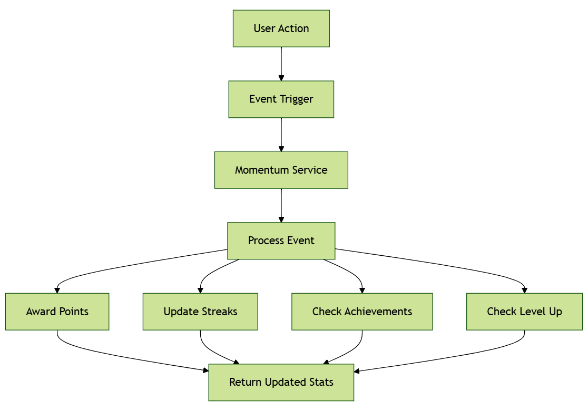
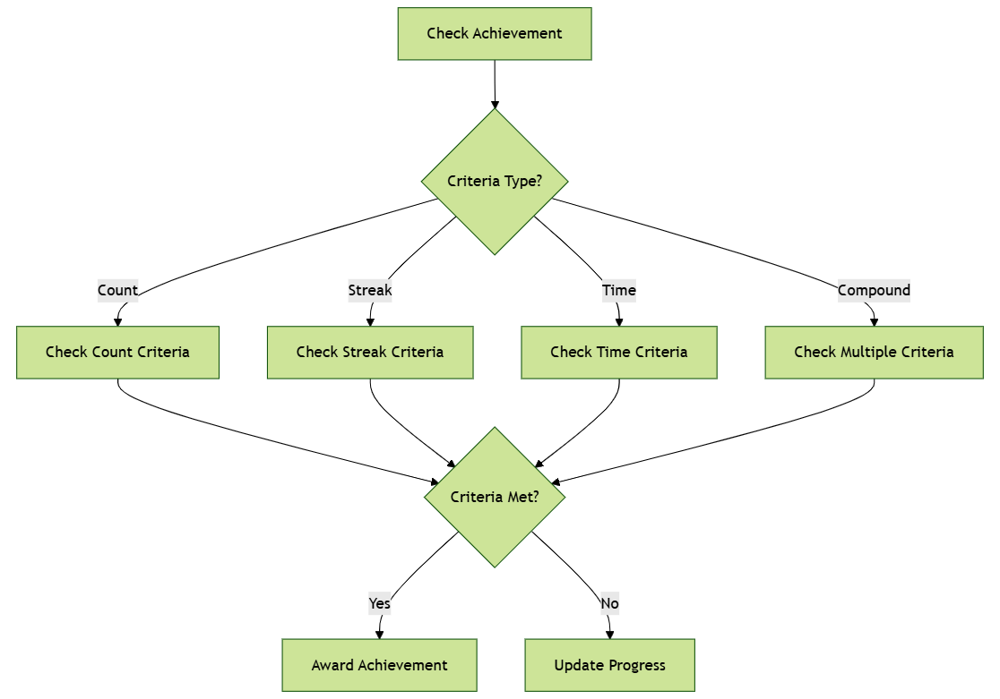

# Momentum Module

## Features

### 1. Point System
- Dynamic point allocation based on user actions
- Multiple point categories:
  - Task completion (10 points)
  - Goal completion (50 points)
  - Goal step completion (15 points)
  - Time slot completion (20 points)
  - Perfect week bonus (100 points)
  - First task of day (5 points)
  - Weekend activity (30 points)
  - Time-based bonuses (early bird/night owl: 15 points each)
- Multipliers for streaks and complexity

### 2. Achievement System
Categories:
- **Productivity**: Task and goal completion milestones
- **Consistency**: Streak-based achievements
- **Time Management**: Schedule and timing-based achievements
- **Focus**: Deep work and concentration achievements
- **Growth**: Learning and progress achievements
- **Social**: Community interaction achievements

### 3. Level System
- 10 progressive levels with exponential point requirements
- Unique titles and perks for each level
- Unlockable features:
  - Custom backgrounds
  - Advanced analytics
  - Special badges
  - Mentor status
  - Custom achievements
  - Legendary status

### 4. Streak System
- Multiple streak types
- Daily activity tracking
- Streak maintenance requirements
- Bonus points for streak milestones

## Technical Architecture

### Database Schema
```sql
users
  ├── current_level_id
  ├── total_points
  ├── weekly_points
  ├── monthly_points
  └── relationships
      ├── achievements
      ├── streaks
      └── current_level

achievements
  ├── name
  ├── description
  ├── points
  ├── category
  ├── criteria_type
  ├── criteria_value
  └── icon_name

user_achievements
  ├── user_id
  ├── achievement_id
  ├── progress
  ├── completed
  └── completed_at

streaks
  ├── user_id
  ├── streak_type
  ├── current_count
  ├── longest_count
  └── last_activity_date

levels
  ├── level_number
  ├── points_required
  ├── title
  └── perks
```

### API Endpoints

```plaintext
GET  /momentum/progress
GET  /momentum/leaderboard
GET  /momentum/achievements
GET  /momentum/streaks
GET  /momentum/stats
POST /momentum/event
GET  /momentum/levels
GET  /momentum/achievements/available
```


### Event Triggering
```python
# In your task completion handler
async def complete_task(task_id: int, user_id: int):
    # Complete task logic
    task.completed = True
    
    # Trigger momentum event
    await momentum_service.process_event(
        user_id=user_id,
        event_type='task_completion',
        metadata={
            'task_id': task_id,
            'complexity': task.complexity
        }
    )
```

### Progress Tracking
```python
# Get user progress
progress = await momentum_service.get_user_progress(user_id)

# Get momentum stats
stats = await momentum_service.get_momentum_stats(user_id)
```

## Configuration

### Point Events
Define point values in `momentum.py`:
```python
POINT_EVENTS = {
    'task_completion': 10,
    'goal_completion': 50,
    # ...
}
```

### Achievements
Add new achievements in `momentum.py`:
```python
ACHIEVEMENTS = [
    {
        'name': 'Task Master',
        'description': 'Complete 100 tasks',
        'points': 500,
        'category': AchievementCategory.PRODUCTIVITY,
        'criteria_type': CriteriaType.COUNT,
        'criteria_value': 100,
        'icon_name': 'trophy'
    },
    # ...
]
```


1. **Event Processing**
   - Always include relevant metadata
   - Handle events asynchronously
   - Implement proper error handling


## Testing [TODO]

Run tests with:
```bash
pytest tests/momentum/
```

Key test areas:
- Point calculation
- Achievement verification
- Streak maintenance
- Level progression
- API endpoints

## Possible Future Enhancements [FUTURE]

1. **Social Features**
   - Team achievements
   - Collaborative challenges
   - Social sharing

2. **Analytics**
   - Productivity insights
   - Achievement patterns
   - Engagement metrics


### Event Flow

1. User Action


2. Achievement Processing
